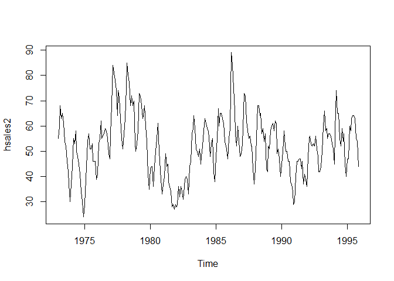
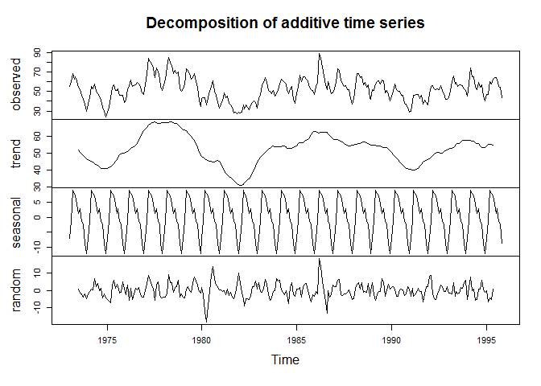
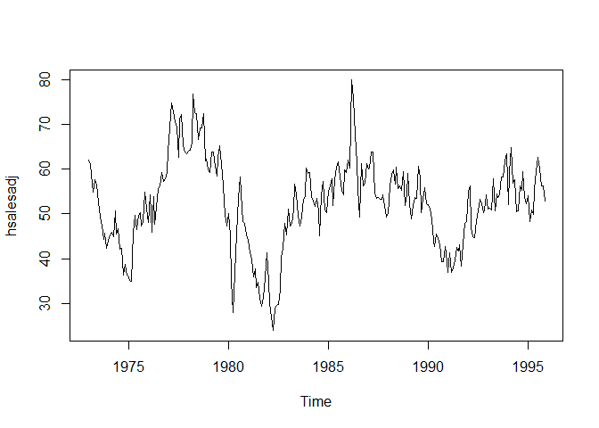
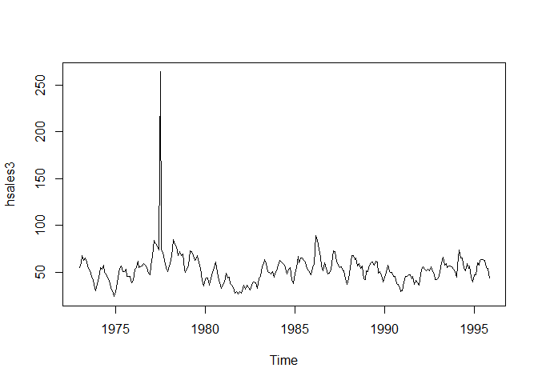
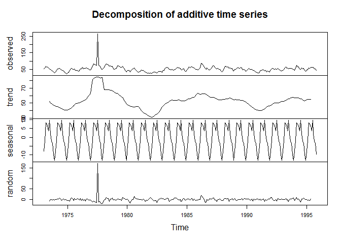
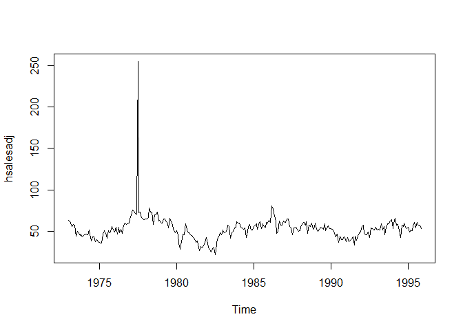
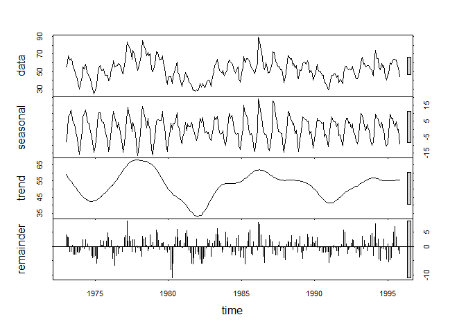

# Live Session 11
Tracie Scott  
November 28, 2016  
# Tracie Scott - Live Session 11 
# Using hSales data


```r
knitr::opts_chunk$set(echo = TRUE)
# Display session info
sessionInfo()
```

```
## R version 3.3.0 (2016-05-03)
## Platform: x86_64-w64-mingw32/x64 (64-bit)
## Running under: Windows 10 x64 (build 14393)
## 
## locale:
## [1] LC_COLLATE=English_United States.1252 
## [2] LC_CTYPE=English_United States.1252   
## [3] LC_MONETARY=English_United States.1252
## [4] LC_NUMERIC=C                          
## [5] LC_TIME=English_United States.1252    
## 
## attached base packages:
## [1] stats     graphics  grDevices utils     datasets  methods   base     
## 
## loaded via a namespace (and not attached):
##  [1] magrittr_1.5    formatR_1.4     tools_3.3.0     htmltools_0.3.5
##  [5] yaml_2.1.13     Rcpp_0.12.4     stringi_1.0-1   rmarkdown_0.9.6
##  [9] knitr_1.13      stringr_1.0.0   digest_0.6.9    evaluate_0.9
```

```r
# load any packages required
library(fpp) #fpp package must be installed first
```

```
## Warning: package 'fpp' was built under R version 3.3.2
```

```
## Loading required package: forecast
```

```
## Warning: package 'forecast' was built under R version 3.3.2
```

```
## Loading required package: zoo
```

```
## 
## Attaching package: 'zoo'
```

```
## The following objects are masked from 'package:base':
## 
##     as.Date, as.Date.numeric
```

```
## Loading required package: timeDate
```

```
## Warning: package 'timeDate' was built under R version 3.3.2
```

```
## This is forecast 7.3
```

```
## Loading required package: fma
```

```
## Warning: package 'fma' was built under R version 3.3.2
```

```
## Loading required package: tseries
```

```
## Warning: package 'tseries' was built under R version 3.3.2
```

```
## Loading required package: expsmooth
```

```
## Warning: package 'expsmooth' was built under R version 3.3.2
```

```
## Loading required package: lmtest
```

```r
# SET WORKING DIRECTORY HERE!!
setwd("C:/Users/User/Documents/hsales")

# remember that the working directory gets reset between chunks
```

# Problem: Time Series
####Plot the time series. 
####Can you identify seasonal fluctuations and/or a trend? 
## Plot for Time Series


```r
library(fpp) #fpp package must be installed first
hsales2 <- ts(hsales,start=c(1973,1),frequency=12)
plot(hsales2)
```

<!-- -->

## Response for Time Series
#### Notice repeated spikes in the data of similar magnitude that could be seasonal fluctuations. 
#### While the data is fluctuating over time, there is not a consistent trend.
#### .  
# Problem : Traditional Decommposition
#### Use a classical decomposition to calculate the trend-cycle and seasonal indices. 
#### Do the results support the graphical interpretation from part (a)?
## Plot for Traditional Decomposition


```r
fitd <- decompose(hsales)
plot(fitd)
```

<!-- -->

## Response for Traditioanl Decomposition
#### Yes, this also seems to show a repeated seasonal component without a constant trend from start to finish. 
#### The decompose also shows a significant ‘random’ effect after the trend and seasonal components are removed.
#### .
# Problem:  Seasonally Adjusted
#### Compute and plot the seasonally adjusted data.
## Plot for Seasonally Adjusted


```r
hsalesadj <- seasadj(fitd)
plot(hsalesadj)
```

<!-- -->

## Response for Seasonally Adjusted
#### If this chart 'removes' the seasonal findings, then it appears that most of the fluctuations are due to 
#### random variations in the data as the seasonally adjusted chart looks much like the original data.
#### . 
# Problem: Create Outlier
#### Change one observation to be an outlier (e.g., add 500 to one observation)
#### Recompute the seasonally adjusted data. 
#### What is the effect of the outlier?
#### Does it make any difference if the outlier is near the end rather than in the middle of the time series?
## Plost for Outlier (mid-series)


```r
hsales3 <- ts(c(hsales[1:54],hsales[55]+200,hsales[56:275]),start=c(1973,1),frequency=12)
plot(hsales3)
```

<!-- -->

```r
fitd <- decompose(hsales3)
plot(fitd)
```

<!-- -->

```r
hsalesadj <- seasadj(fitd)
plot(hsalesadj)
```

<!-- -->

## Response for Create Outlier
#### The outlier makes the seasonally adjusted chart much harder to interpret,
#### but it does not appear to have a significant impact on the analysis.
#### .
# Problem Decompose with STL
#### Now use STL to decompose the original series.
#### Do the results support the graphical interpretation from part (a)?
## Plot for STL


```r
fit <- stl(hsales, s.window=5)
plot(fit)
```

<!-- -->

## Response for STL
#### The output from stl reflects more variability in the seasonal component than did decompose, 
#### but the results are similar. Both decomposition methods seem to indicate there is a repeated seasonal
#### pattern without a pronounced upward or downward trend over time. 
#### However, the ‘random’ and ‘residual’ plots show a great deal of unexplained variability in the data even after
#### removing the seasonal the trend components.
